# Diary Mood App

  [Go to Code Documentation](#code-documentation)
  <br>
  [Download latest APK](https://github.com/xdiach00/DiaryMoodApp/releases/tag/v1.0.0-beta) - v1.0.0-beta for debugging

## App Description

Hi! **DiaryMoodApp** is an app to store your notes and track your mood.

<div style="text-align: center;">
  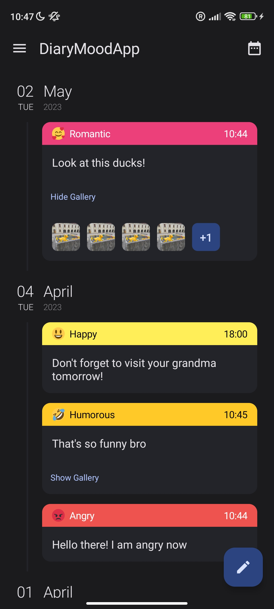
   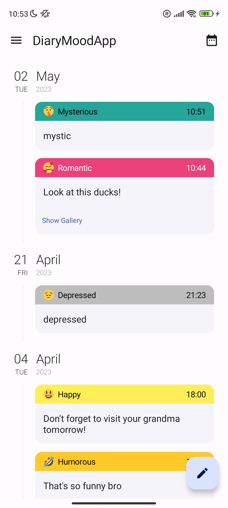
   <br>
  <sub>Home Screen in Dark and Light modes</sub>
</div>
<br>

- You can add note, choose your mood from a list by simply left/right swiping an emoji, set a custom date and time of current note by clicking on a calendar icon at the Top bar (and restore this date).

<div style="text-align: center;">
  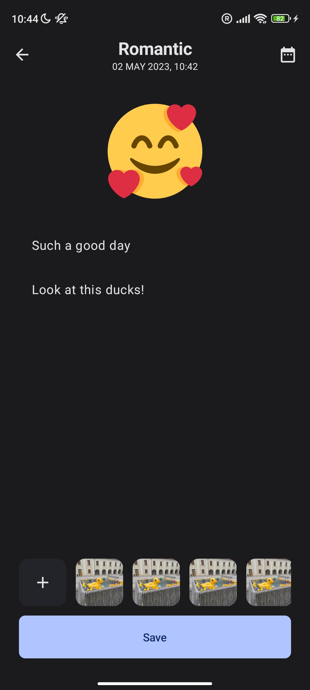
  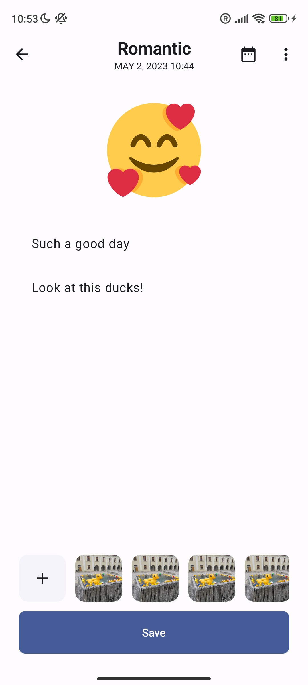
  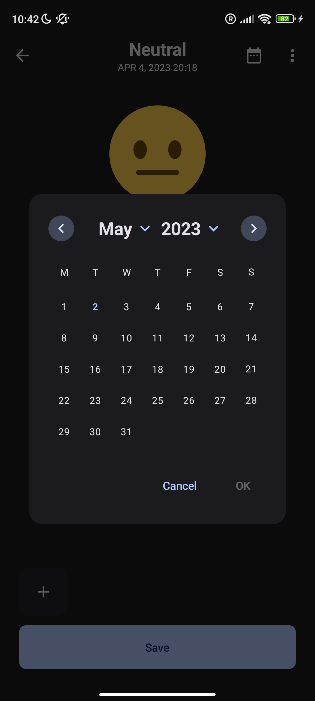
  <br>
  <sub>Write Screen in Dark and Light modes</sub>
</div>
<br>

- Date filtering for your diaries (notes) is available!

<div style="text-align: center;">
  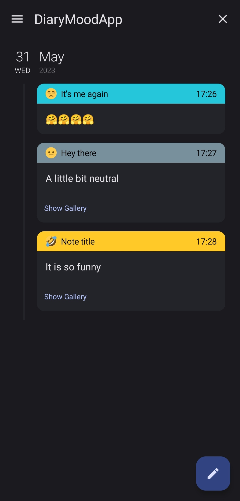
  <br>
  <sub>Home Screen filtered by date in Dark mode</sub>
</div>
<br>

- Using a side menu, you can change to statistics tab or easily erase all your diaries or log out!

<div style="text-align: center;">
  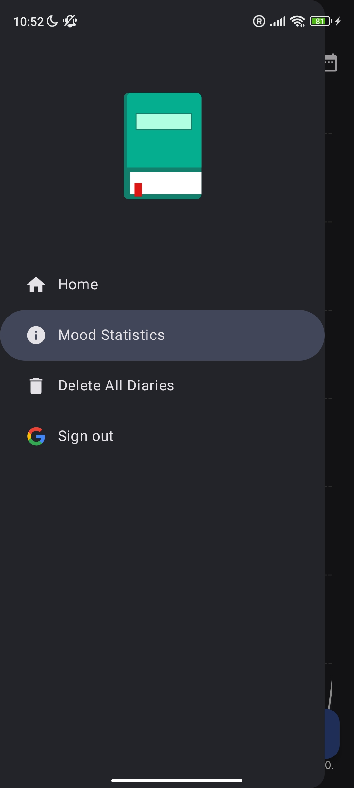
  <br>
  <sub>Side menu in Dark mode</sub>
</div>
<br>

- Statistics screen display your tracked mood as a Line Chart. You can also filter statistics by date, in this case  it will be displayed as a Column Chart.

<div style="text-align: center;">
  
  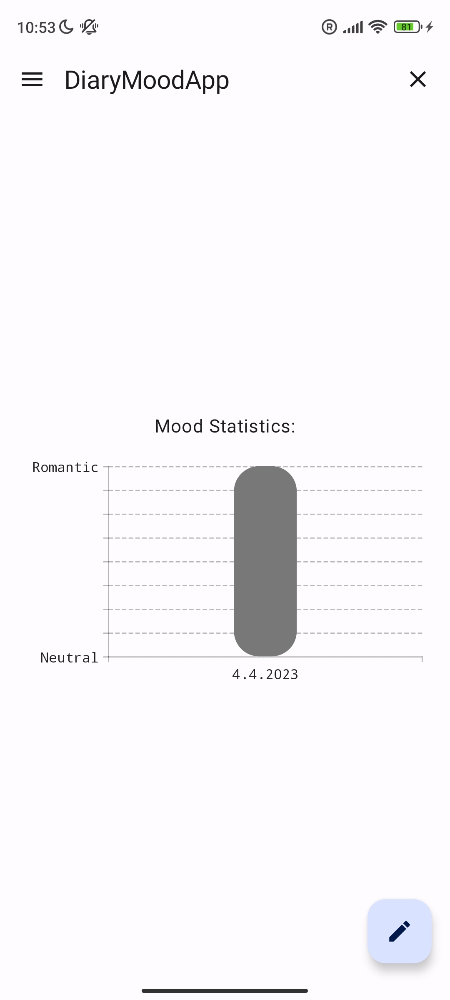
  <br>
  <sub>Statistics tab in Dark mode; Filtered stats in Light mode</sub>
</div>
<br>

- Each note is synchronised with cloud **NoSQL MongoDB** (not crypted 😖)

<div style="text-align: center;">
  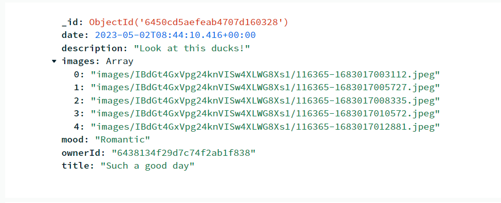
  <br>
  <sub>MongoDB stores an array of links to the Firebase for images</sub>
</div>
<br>

- Images are uploaded to **Firebase storage** (not cryptedx2 😖)

<div style="text-align: center;">
  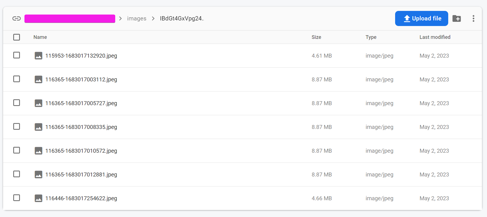
  <br>
  <sub>Images are stored in the user's id package</sub>
</div>
<br>

- Application allows users to simply log in using their Google accounts.

<div style="text-align: center;">
  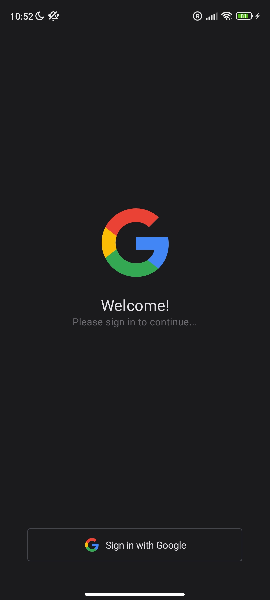
  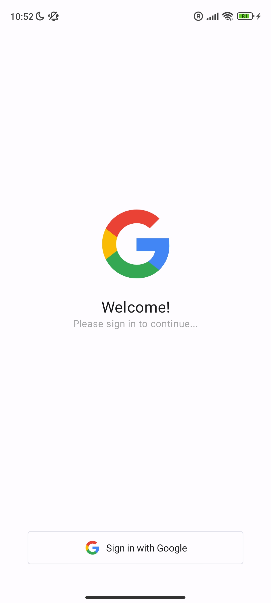
  <br>
  <sub>Authorization Screen in Dark and Light modes</sub>
</div>


## Code Documentation
  
  [Go to App Description](#app-description)

### Summary

The application is developed in the **Kotlin** language using the latest technology and recommendations by Google. The application is based on a **multi-modular MVVM** architecture according to *SOLID* principles using *Dagger Hilt* for dependency injection. The UI is implemented using **Jetpack Compose** and **Material Design 3** design system. Kotlin **Coroutines** and **Flows** are used to work with asynchronous tasks.

### Building

To build this app on your own PC, you need to create a file `core/util/src/main/java/com/xdiach/util/PrivateConstants.kt` with the following content:
```
object PrivateConstants {
    const val APP_ID = "<Mongo Atlas APP ID>"
    const val CLIENT_ID = "<OAuth Google Cloud Key>"
}
```
Create a project in [MongoDB](https://cloud.mongodb.com/)

Get OAuth [Google Cloud](https://console.cloud.google.com/apis/credentials) key

### Dependencies

Project uses the following libraries:

- [Jetpack Compose](https://developer.android.com/jetpack/compose)
- [Kotlin Coroutines](https://github.com/Kotlin/kotlinx.coroutines)
- [Firebase Auth](https://firebase.google.com/docs/auth/android/start)
- [Firebase Storage](https://firebase.google.com/docs/storage/android/start)
- [Room](https://developer.android.com/training/data-storage/room)
- [Koin](https://insert-koin.io/docs/setup/koin/)
- [Coil](https://coil-kt.github.io/coil/compose/)
- [Accompanist Pager](https://google.github.io/accompanist/pager/)
- [Sheets Compose Dialog](https://github.com/maxkeppeler/sheets-compose-dialogs)
- [Message Bar Compose](https://github.com/stevdza-san/MessageBarCompose)
- [One Tap Compose](https://github.com/stevdza-san/OneTapCompose)
- [Desugar JDK](https://github.com/google/desugar_jdk_libs)
- [Vico](https://github.com/patrykandpatrick/vico)
