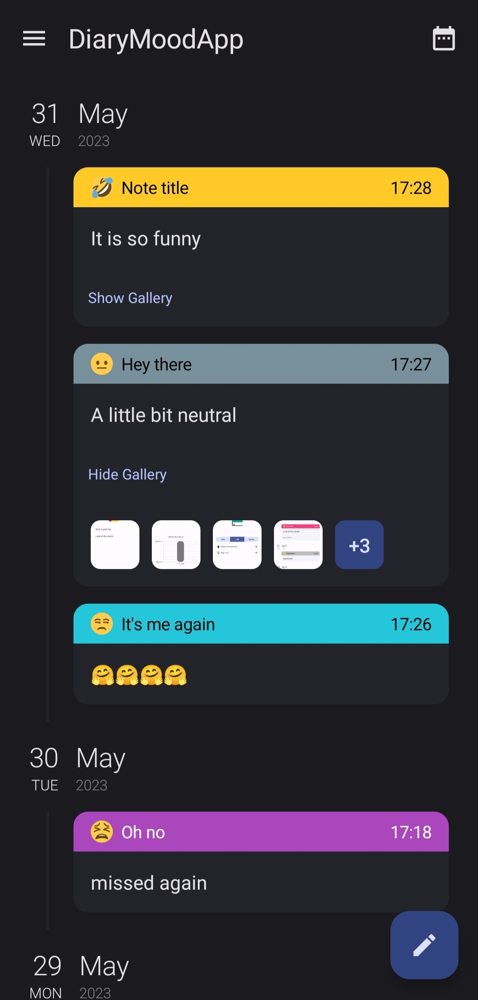
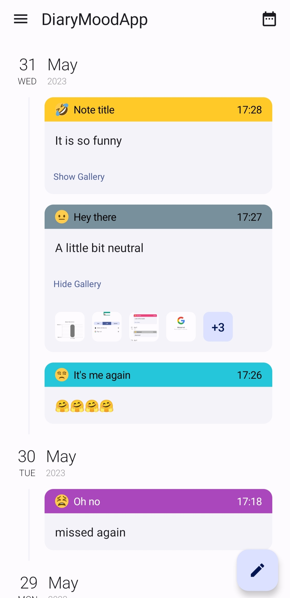
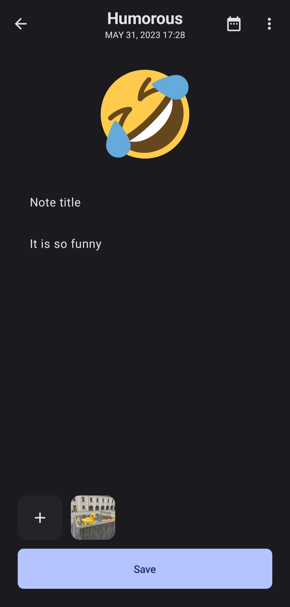
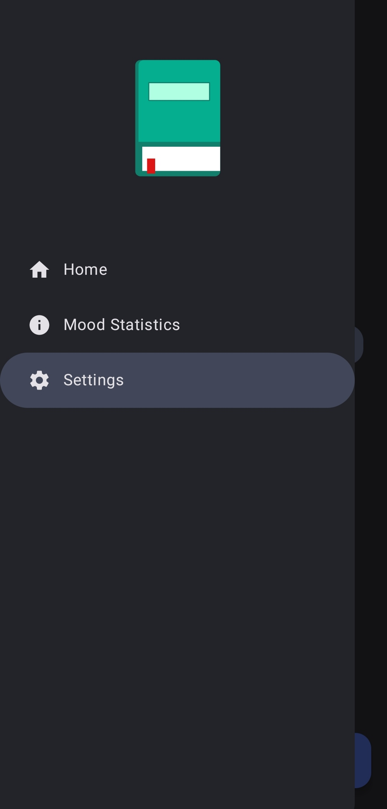

# Diary Mood App

Hi! **DiaryMoodApp** is an app to store your notes and track your mood.

  
   
    
  Home Screen in Dark and Light modes

 

- You can add note, choose your mood from a list by simply left/right swiping an emoji, set a custom date and time of current note by clicking on a calendar icon at the Top bar (and restore this date).

  
  
  
   
  Write Screen in Dark and Light modes

 

- Date filtering for your diaries (notes) is available!

  
   
  Home Screen filtered by date in Dark mode

 

- Using a side menu, you can change to statistics tab or easily erase all your diaries or log out!

  
   
  Side menu in Dark mode

 

- Statistics screen display your tracked mood as a Line Chart. You can also filter statistics by date, in this case  it will be displayed as a Column Chart.

  
  
   
  Statistics tab in Dark mode; Filtered stats in Light mode

 

- Each note is synchronised with cloud **NoSQL MongoDB** (not crypted 😖)

  
   
  MongoDB stores an array of links to the Firebase for images

 

- Images are uploaded to **Firebase storage** (not cryptedx2 😖)

  
   
  Images are stored in the user's id package

 

- Application allows users to simply log in using their Google accounts.

  
  
   
  Authorization Screen in Dark and Light modes

